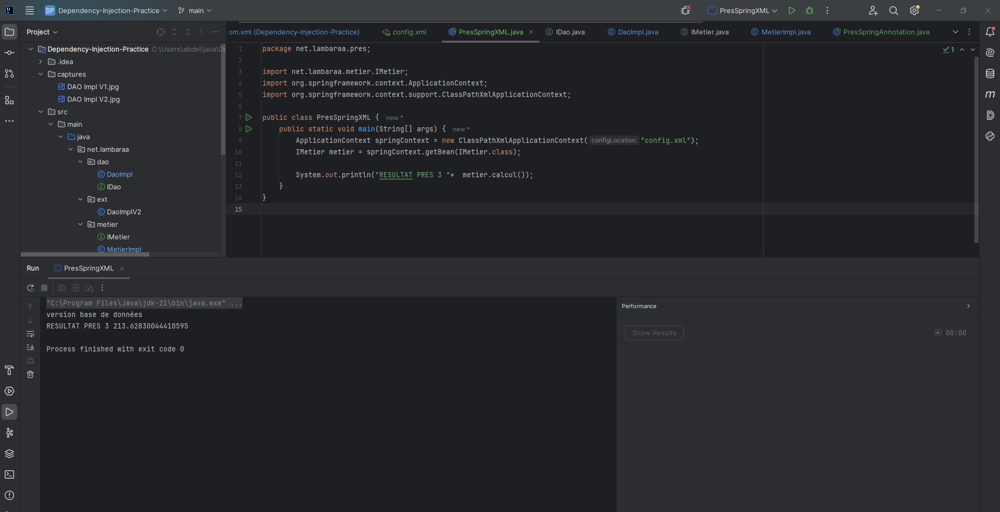
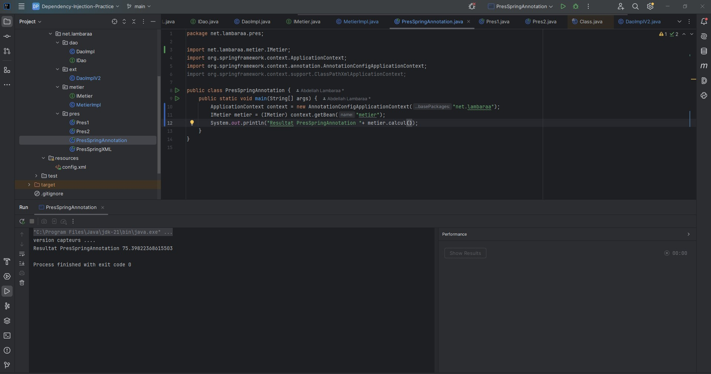

# Activité Pratique N°1 – Injection des dépendances en Java & Spring

**Auteur** : Abdellah Lambaraa  
**Encadrant** : Mohamed Youssfi
---

## 🎯 Objectif

Appliquer les concepts d’injection des dépendances à travers plusieurs approches :
- Couplage fort (instanciation directe)
- Couplage faible (instanciation dynamique)
- Injection via Spring :
    - Configuration XML
    - Annotations

---

## 📁 Structure du projet

```
src/
 └── main/
     └── java/
         └── net.lambaraa/
             ├── dao/
             │   ├── IDao.java
             │   ├── DaoImpl.java
             │   └── ext/DaoImplV2.java
             ├── metier/
             │   ├── IMetier.java
             │   └── MetierImpl.java
             └── pres/
                 ├── Pres1.java               // Instanciation statique
                 ├── Pres2.java               // Instanciation dynamique
                 ├── PresSpringXML.java       // Spring XML
                 └── PresSpringAnnotation.java// Spring Annotations
     └── resources/
         └── config.xml                       // Fichier Spring XML
```

---

## 🧪 Exécution des différentes méthodes

### ✅ 1. Instanciation statique (`Pres1`)

📸 **Capture :**  


---

### ✅ 2. Instanciation dynamique (`Pres2`)

Lecture des classes depuis un fichier `config.txt`, puis injection via réflexion.

📸 **Capture :**  


---

### ✅ 3. Injection avec Spring (XML) – `PresSpringXML`

```java
ApplicationContext context = new ClassPathXmlApplicationContext("config.xml");
IMetier metier = context.getBean(IMetier.class);
System.out.println("RESULTAT PRES 3 : " + metier.calcul());
```

📸 **Capture :**  


---

### ✅ 4. Injection avec Spring (Annotations) – `PresSpringAnnotation`

📸 **Capture :**  


---
## ✅ Bonnes pratiques suivies

- Utilisation des interfaces pour découpler le métier de la couche DAO
- Injection respectant les conventions JavaBeans
- Découpage clair du projet (`dao`, `metier`, `pres`)
- Captures régulières pour chaque étape

---

## 🧾 Fichier `config.txt` utilisé pour l’injection dynamique

```
net.lambaraa.dao.ext.DaoImplV2
net.lambaraa.metier.MetierImpl
```

---

## 📌 Conclusion

Cette activité m’a permis de bien comprendre les fondements de l’injection des dépendances en Java pur et en utilisant le framework Spring. L’évolution de la solution à travers les différentes méthodes (statique → dynamique → Spring XML → annotations) m’a offert une vision claire de la flexibilité offerte par le couplage faible.

---